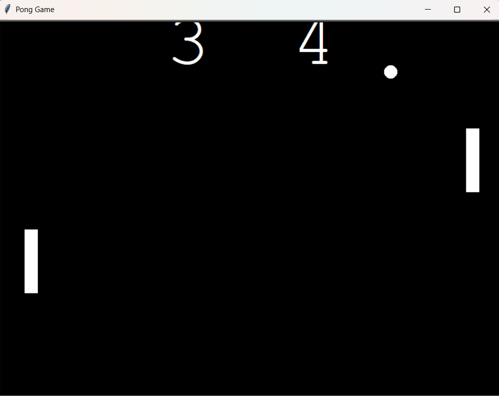

# 🕹️ Pong Game – Classic Arcade Game in Python
This is a simple yet complete implementation of the classic Pong Game using Python's turtle graphics module. The game features two paddles, a bouncing ball, and a scoreboard. It's a great beginner-friendly project to understand OOP in Python, collision detection, and GUI control using keyboard inputs.

# 🎮 Game Features
- Two-player paddle control (W/S for Left Player, ↑/↓ for Right Player)

- Ball bounces on paddle and screen borders

- Automatic scorekeeping for both players

- Speed increases with each bounce for added difficulty

- Clean and minimal graphics using turtle

# ✅ Prerequisites
- Python 3.x

- No external libraries required (only uses built-in turtle module)

# 🎮 Controls
| Player        | Move Up       | Move Down     |
| ------------- | ------------- | ------------- |
| Left          | W             | S             |
| Right         | ↑             | ↓             |

# 🧠 Concepts Used
- Object-Oriented Programming (Classes, Inheritance)

- Event-driven programming (onkey() listener)

- Collision detection

- Simple animations with turtle

- Game loop using while

## 📸 Screenshot

# 🙏 Thank You
Thanks for checking out this project!
If you're learning Python and graphics programming, this game is a fun way to explore how game mechanics work.

Feel free to ⭐️ star the repo or share it if you found it helpful. Happy coding! 🐍🎮

--Abhijeet--
